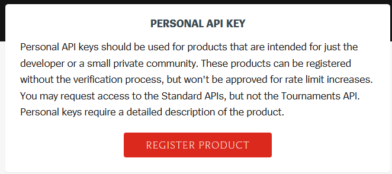
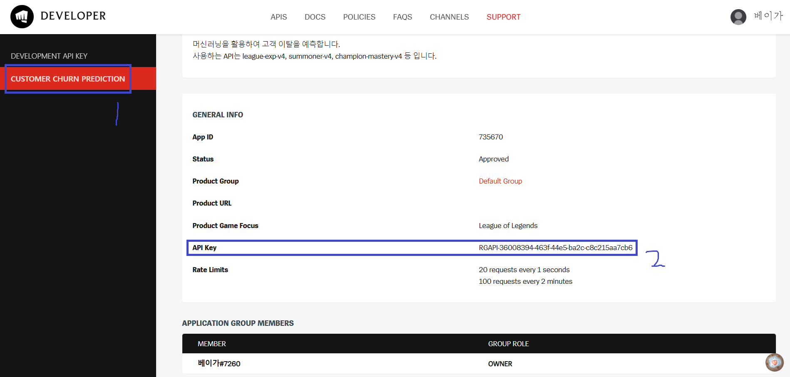

### 주요 코드
- 실행 코드 : create_data.py
- 라이브러리 코드 : lib/get_data.py

**이외에 다른 코드는 사용 불가상태**

### 변경해야할 코드
- api_key : 자신의 api_key로 변경
- 경로 설정 : path1, path2에서 csv의 경로를 자신이 얻고자하는 티어명으로 변경 
- player information을 가져오고 싶은 경우
    - tiers : 자신이 가져올 티어로 변경

### 코드 실행 순서
1. player 정보 부분 주석 풀고 실행하여 데이터셋 생성
2. 생성된 데이터셋을 가지고 summoner 부분 주석 풀고 실행 (player 정보를 가져오는 부분은 주석 처리)

### API Key
1. Riot developer 접속 : https://developer.riotgames.com
2. 우측 상단의 아이디 누르고 DASHBORD 클릭
3. personal API Key에 REGISTER PRODUCT 클릭

4. 정보 입력하고 생성
5. 생성 완료되었으면 우측 상단에 아이디 누르고 APP 클릭
6. 왼쪽 카테고리에서 자신이 생성한 personal key 누르면 고정 API Key 복사
